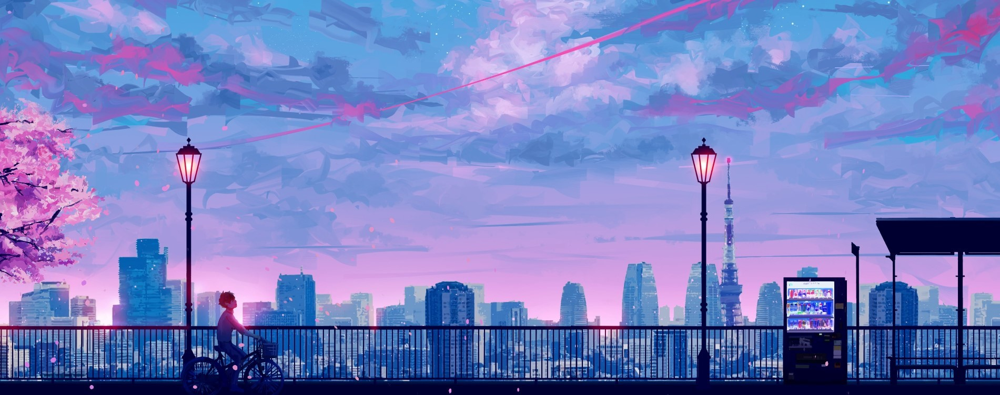

# **The Anime Quiz**

The Anime Quiz is a basic quiz website that tests users on their understanding of anime by asking more unconventional questions about a variety of anime shows not touched on in other similar anime quizes online. The site aims to provide an environment in which users can challenge themselves on their knowledge in a fun and simple way.

The Anime Quiz will test users on 10 different anime, provide four possible answers and be awarded 10 points for each correct answer, marked out of a possible 100. 

From one anime lover to another, welcome to <a href="https://github.com/Bunkit18/The-Anime-Quiz-Javascript-Milestone-Project-2">**The Anime Quiz**</a>.

# Table of Contents

* [**User Experience (UX)**](<#user-experience-ux>)
    * [**Design**](<#design>)
        * [**Site Structure**](<#site-structure>)
        * [**Colour Scheme**](<#colour-scheme>)
        * [**Typography**](<#typography>)
        * [**Imagery**](<#imagery>)
        * [**Wireframes**](<#wireframes>)
    * [**Features**](<#features>)
        * [**Current Features**](<#current-features>)
        * [**Future Features**](<#future-features>)
    * [**Technologies Used**](<#technologies-used>)
    * [**Testing**](<#testing>)
        * [**W3C Validation**](<#w3c-validation>)
        * [**User Experience Testing**](<#user-experience-testing>)
        * [**Known Bugs or Issues**](<#known-bugs-or-issues>)
    * [**Deployment**](<#deployment>)
    * [**Credits**](<#credits>)

# User Experience (UX)

* ## User Stories

    * As a user I want to be able to navigate through the whole site smoothly.
    * As a user I want to understand the purpose of the site upon loading it.
    * As a user, I want to be able to take a quiz on anime.
    * As a user, I want to be able to choose an answer and be marked on correctness.
    * As a user, I want to be able to challenge myself on anime knowledge.
    * As a user, I want to be able to interact with a simple website design without complications.
    * As a user, I want to be able to be provided example images of the anime i'm questioned on.
    * As a user, I want to visually gauge if my answers are correct.
    * As a user, I want to be able to exit the quiz at any time and return to the home page.

[Return to top](<#table-of-contents>)

# Design

* ## Site Structure 

    The Anime Quiz is a single webpage, with [The Anime Quiz](index.html) being the default loading page. The webpage is separated into sections which are toggled in response to user interaction using Javascript.

    The sections are as follows: 
    - Home - The initial welcoming screen loaded; 
    - Instructions - A help screen that informs the user how to play; 
    - Quiz - The section loaded that contains the main quiz content and interactivity which includes: a logo that returns the user to the home screen, a score area that keeps track of the user score, a header providing a question, an image related to the question being asked, four possible answers; 
    - End-of-Quiz Section - A screen that is toggleld upon completion of the quiz and marks the users final score.

    [Return to top](<#table-of-contents>)

* ## Colour Scheme

    The colour scheme was determined based on the initial background image found on Google by the artist [SeerLight](https://www.deviantart.com/seerlight) using [Colour Picker online](https://imagecolorpicker.com/en), which extracted the following chosen palette.

    

    Palette :

    

    This palette was chosen due to the fantasy style the colour palette portrayed and how the colours were playful and bright, which suited the aim of the quiz. White or black font were chosen as required to ensure readability for all users.

    [Return to top](<#table-of-contents>)

* ## Typography

    Using [Google Fonts](https://fonts.google.com/), I matched up my preferred font style for The Anime Quiz and decided on Orbitron in regular 400 as a header font, and Trebuchet MS for lesser headers and paragraphs. This had a clean and condensed look, with the Trebuchet font being a popular choice for subtitle fonts in anime. 
    
    Both used sans serif as a fallback font in the event that either chosen font doesn't load.  

    [Return to top](<#table-of-contents>)

* ## Imagery

    My background image is a digital art piece by artist [SeerLight](https://www.deviantart.com/seerlight), which depicts a male anime character riding a bicycle against a saturated pink and blue skyline. The image was found on [Google](https://www.google.com/), where a lot of The Anime Quiz images were sourced from. It was the ideal image for the quiz as the palette was playful and vibrant yet relaxing.

    Other images in The Anime Quiz are the ownership of the creators of the anime themselves, however, had been sourced by the following websites, through the use of Google:

    * [Deviant Art - Superheroarts](https://www.deviantart.com/superheroarts)

    * [Pinterest](https://www.pinterest.co.uk/pin/774830310863531564/)

    * [Fandom](https://characters.fandom.com/wiki/Kazuto_Kirigaya)

    The direct sources of some of the images used could not be traced due to extensive use among a large variety of sites. 

    [Return to top](<#table-of-contents>)

* ## Wireframes

    Initial Wireframe template was sourced from [Balsamiq](https://balsamiq.com/) and supplemented in Adobe Photoshop.

    Home page wireframe - There were three initial designs for the home page and all three, including the final design are below:

    

    

    

    Instructions page:

    

    Quiz Page:

    

    Congratulations Page:

    

    These are not individual html pages. The website was designned to maximise the use of Javascript, therefore only one html page is used and the different sections are toggled using javascript.
    
    There may be differentation in the final site due to responsiveness.

    [Return to top](<#table-of-contents>)

# Features

The Anime Quiz was created with ease of navigation in mind. A navigation bar is included in the home page, headed by a h1 header element and containing the two buttons for navigation. Each section has a linked connection to each section for easy site navigation. Each section is designed to be simple and have a simplistic structure to ensure the site is easy to use and navigate and that the User Interface isn't too cluttered or hard to navigate.
    
All pages are responsive for other viewports, such as tablets and mobiles. The structure of the page may differ in different viewports.

[Return to top](<#table-of-contents>)

* ## Current Features

    ### Title page and Navigation

    * The front page upon loading the site. The page includes the Anime Quiz header and logo, introductory greeting, brief hint to users where to navigate for the quiz or for instructions, two buttons in a nav section that leads to instructions on how to play or the quiz and a small footer.

    * The Home page section is the only html section that is visible on-load. The home page can be toggled based on user interaction (buttons).

    * The instructions button cursor changes to the help cursor to assist in conveying to the user the location for help.

    

    

    ### Instructions Page

    * The instructions page contains a simple header, paragraph element and button on a coloured div backdrop to assist with font accessibility.

    * The button returns the user to the main home page after confirming they had read the instructions, which toggled the visibility of the instructions and home pages.  

    

    ### Quiz Page

    * The quiz page is included in the main section of content for the site, which includes: 

        - An interactable Anime Quiz Logo, that will underline on hover of the mouse to inform the user of the link effect.
        - A score area that keeps track of the users correct answers in a series of 10 points, populated by javascript. 
        - A header in which the question will be shown using javascript.
        - An image in which javascript will display an image related to the question.
        - Four buttons containing four possible answers, populated by javascript, which the user can interact with and will change colour according to whether the answer chosen is correct or incorrect. If the incorrect answer is chosen, the correct answer will also change colour to reveal the correct answer to the user.
        - An arrowed button that directs the user to the next question.
        - A coloured div backdrop to assist in font contrast for accesibility purposes. 

    
    

    ### Congratulations Page

    * A page that thanks the user for playing, provides their final score and adds a line of text depending on their final score. The final button relocates the user to the main home page of the quiz.

    

    

    

[Return to top](<#table-of-contents>)

* ## Future Features

This section contains ideas for potential upgrades to the site in the near future.

* A randomisation feature for the question and answers variables that randomises the order in which the questions are presented.

* Different difficulty levels which would increase the number of questions asked and the difficulty of the questions.

* Animation features for the title page and quiz page that adds more interactivity to the page, animates the buttons or shows a burst of confetti upon completion of the quiz.

* A scoreboard where the can enter a username and logs their highscores.

[Return to top](<#table-of-contents>)

# Technologies Used 

Languages used in this project:

* HTML5
* CSS3
* Javascript

Frameworks, Libraries and Programs used:

* [Bootstrap](https://getbootstrap.com/docs/4.4/getting-started/introduction/) - responsive media queries.
* [Hover.css](https://ianlunn.github.io/Hover/) - for :hover instances for links.
* [Balsamiq](https://balsamiq.com/) - partial wireframe.
* [Adobe Photoshop](https://www.adobe.com/uk/products/photoshop/) - additional wireframe features
* [Google Fonts](https://fonts.google.com/) - Fonts.
* [Font Awesome](https://fontawesome.com/) - Icons.
* [Github](https://github.com/) - repository storage.
* [Gitpod](https://gitpod.io/) - compiler and Git code storage.

[Return to top](<#table-of-contents>)

# Testing 

Testing was involved in every stage of the creation of The Anime Quiz's creation, in an ongoing process with Google's Developer Tools, as well as WC3's validation services for HTML markup and CSS. 

Upon finalisation of The Anime Quiz, the site passed its responsiveness tests though Chromes developer tools responsiveness checker.

- The Website was tested on Google Chrome, Internet Explorer, Microsoft Edge and Safari browsers.
- The website was viewed on a variety of devices such as Desktop, Laptop, iPhone7, iPhone 8 & iPhoneX.
- A large amount of testing was done to ensure that all pages were linking correctly.
- Friends and family members were asked to review the site and documentation to point out any bugs and/or user experience issues.

[Return to top](<#table-of-contents>)

* ## W3C Validation

    The Anime Quiz site has been validated by these services, which ensure that the syntax for the site is clear and error-free.

    

    

    

    [Return to top](<#table-of-contents>)

* ## User Experience Testing

* As a user I want to be able to navigate through the whole site smoothly.

    1. Page html elements are no less than 4 and no more than 12 and are well spaced out, allowing for a simple user interface that is intuitive and easy to navigate.

    2. The page fits to the viewport height and width of the device its viewed on unless the screen is too small and scrolling is required. This keeps scrolling to a minimum, if necessary and avoid it at all on larger device screens.

    3. Each page section has a flowing style structure that connects each page to another of relevance. The home page can be accessed from all other sections.

* As a user I want to understand the purpose of the site upon loading it.

    1. The home page users view on load denotes the purpose of the site 'The Anime Quiz' in large and clear font. 

    2. The background image is inkeeping with the anime theme, clearly informing the user of the content of the site.

* As a user, I want to be able to take a quiz on anime.

    1. The home page users view on load denotes the purpose of the site 'The Anime Quiz' in large and clear font. 

    2. The two navgation buttons on the first screen, "How to Play" and "Play Quiz" limit complexities for the user to the absolute minimum.

    3. The "Play Quiz" button takes users straight to an anime quiz with corresponding question, imagery and answer function.

* As a user, I want to be able to choose an answer and be marked on correctness.

    1. Users are marked out of a score of 100 points and each correct answer adds 10 points to a clearly labeled score section in the top right corner.

    2. Users are immediately informed visually whether their choice in answer is correct, as the background of the button will either change to red or green.

* As a user, I want to be able to challenge myself on anime knowledge.

    1. Users are given slightly more unconventional questions on anime in comparison to other similar quizzes on the web.

    2. future interactivity will allow for a difficulty system in which the user can choose the difficulty for themselves based on their knowledge.

* As a user, I want to be able to interact with a simple website design without complications.

    1. Page html elements are no less than 4 and no more than 12 and are well spaced out, allowing for a simple user interface that is intuitive and easy to navigate.

    2. There is limited possibility for the user to make a mistake interacting with the quiz, other than to accidentally choose the wrong answer, in which the user is given the opportunity to return to the home screen and retake the quiz.

* As a user, I want to be able to be provided example images of the anime i'm questioned on.

    1. Each question of the quiz has its own corresponding image on the anime being questioned on for the user to visually reference. 

* As a user, I want to visually gauge if my answers are correct.

    1. Users are immediately informed visually whether their choice in answer is correct, as the background of the button will either change to red or green.

* As a user, I want to be able to exit the quiz at any time and return to the home page.

    1. Users are informed in the "How to Play" section that a logo in the top left corner will return them to the home screen at any time. The logo will be underlined upon mouse hover to inform the user of possible interactivity.

[Return to top](<#table-of-contents>)

* ## Known Bugs or Issues

    * ### Currently known bugs (CURRENT)

        None.

    * ### Past existing bugs (PAST)

        **Issue #1**

        - Issue with event listeners in javascript for button elements
        
        Status: **FIXED**

        Solution: Remove function brackets '()'. 

        **Issue #2**

        - Issue with insertion of variable key / value pairs to DOM elements
        
        Status: **FIXED**

        Solution: Changed the quizQA variable into an array of objects instead of nested objects as could not iterate through using indexing.

        **Issue #3**

        - Issue with instant cycling through array of questions and answers and presenting only the final question

        Status: **FIXED**

        Solution: Separate the play-quiz function into separate functions that correlates to specific parts using user interactivity (buttons).

        **Issue #4**

        - Issue with images not showing when deployed using javascript function

        Status: **FIXED**

        Solution: Understood that image location would still be relative to the html file instead of the javascript file and changed the image path of all img key / value pairs.

        **Issue #5**

        - Random indentation of elements in the quiz section making each section incrementally indented from left to right.

        Status: **FIXED**

        Solution: Added vertical-align: top to elements this occured on.

        [Return to top](<#table-of-contents>)

## Deployment

* ### GitHub Pages

    The Anime Quiz project was deployed to GitHub Pages using the following steps:

    1. Log in to GitHub and locate the GitHub Repository
    2. At the top of the Repository (not top of page), locate the "Settings" Button on the menu.
    3. Scroll down the Settings page until you locate the "GitHub Pages" Section.
    4. Under "Source", click the dropdown called "None" and select "Master Branch".
    5. The page will automatically refresh.
    6. Scroll back down through the page to locate the now published site link in the "GitHub Pages" section.

 
    
* ### Forking the GitHub Repository

    By forking the GitHub Repository we make a copy of the original repository on our GitHub account to view and/or make changes without affecting the original repository by using the following steps...

    1. Log in to GitHub and locate the GitHub Repository
    2. At the top of the Repository (not top of page) just above the "Settings" Button on the menu, locate the "Fork" Button.
    3. You should now have a copy of the original repository in your GitHub account.

 
    
* ### Making a Local Clone

    1. Log in to GitHub and locate the GitHub Repository
    2. Under the repository name, click "Clone or download".
    3. To clone the repository using HTTPS, under "Clone with HTTPS", copy the link.
    4. Open Git Bash
    5. Change the current working directory to the location where you want the cloned directory to be made.
    6. Type git clone, and then paste the URL you copied in Step 3.
    
            $ git clone https://github.com/Bunkit18/The-Anime-Quiz-Javascript-Milestone-Project-2

    7. Press Enter. Your local clone will be created.

            $ git clone https://github.com/Bunkit18/The-Anime-Quiz-Javascript-Milestone-Project-2

            > Cloning into `CI-Clone`...
            > remote: Counting objects: 10, done.
            > remote: Compressing objects: 100% (8/8), done.
            > remove: Total 10 (delta 1), reused 10 (delta 1)
            > Unpacking objects: 100% (10/10), done.

    
    Click [Here](https://docs.github.com/en/repositories/creating-and-managing-repositories/cloning-a-repository#cloning-a-repository-to-github-desktop) to retrieve pictures for some of the buttons and more detailed explanations of the above process.

[Return to top](<#table-of-contents>)

## Credits

Credits for all imagery used in The Anime Quiz are in the [Imagery](<#imagery>) section.

Further credits are due to:

* [Stack Overflow](https://stackoverflow.com/), [W3Schools](https://www.w3schools.com/) and [MDN](https://developer.mozilla.org/en-US/) for constant reference and assistance on html and css code possibilities.

* Fellow javascript users, who reviewed my code and provided feedback on any bugs experienced on Discord.

* Any other user of the internet or website from which evaluating their source code and processes aided me in creating and fleshing out my own. 

[Return to top](<#table-of-contents>)

    
    

